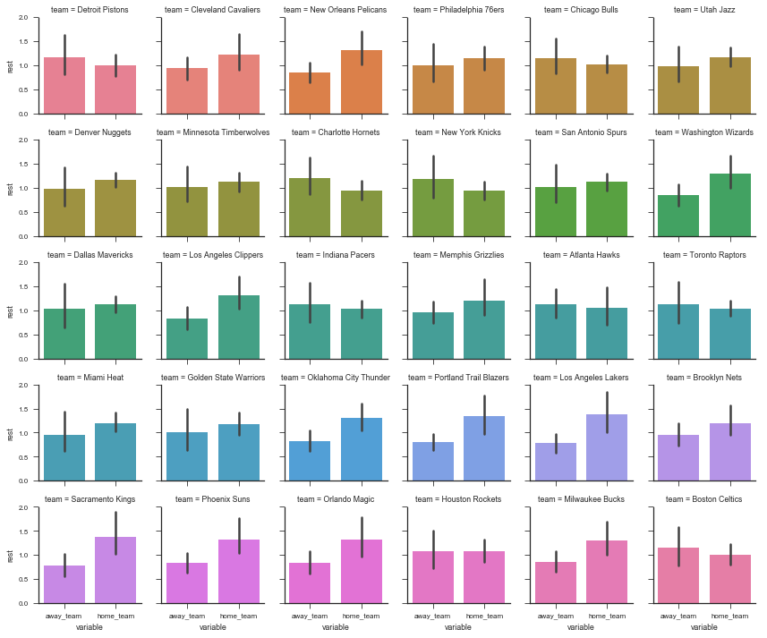
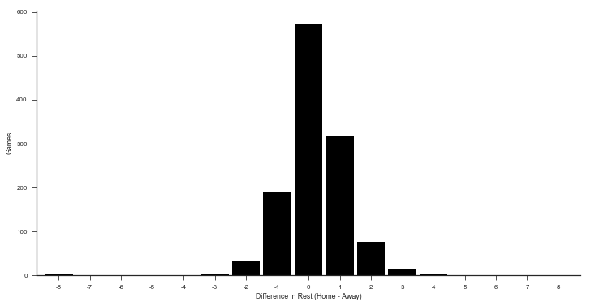
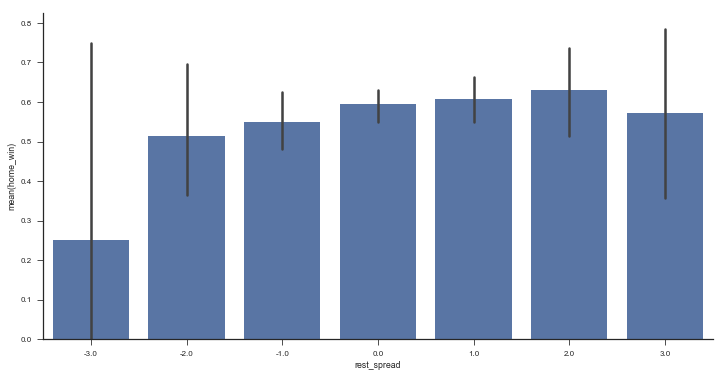
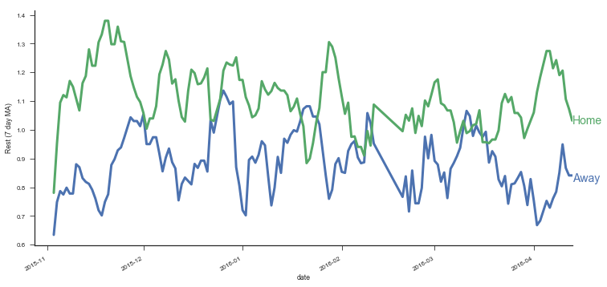
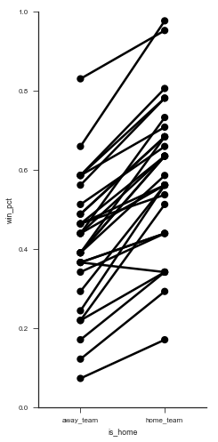
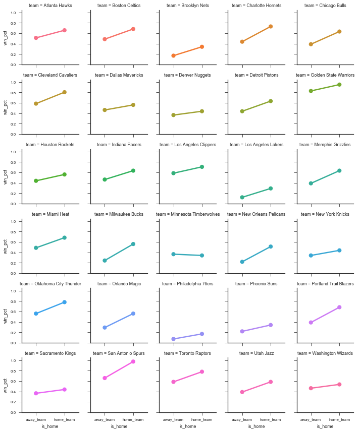
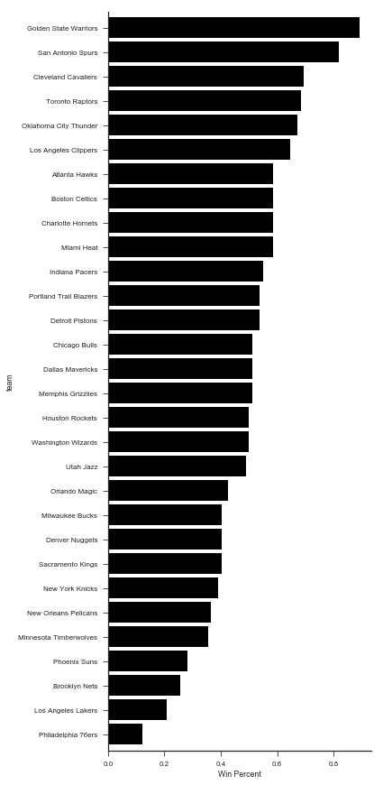
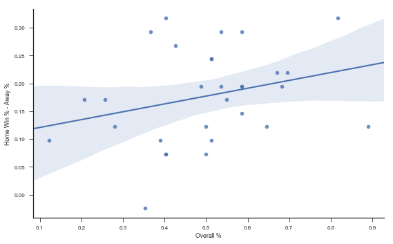

---

This is part 5 in my series on writing modern idiomatic pandas.

- [Modern Pandas](modern-1-intro)
- [Method Chaining](method-chaining)
- [Indexes](modern-3-indexes)
- [Fast Pandas](modern-4-performance)
- [Tidy Data](modern-5-tidy)
- [Visualization](modern-6-visualization)
- [Time Series](modern-7-timeseries)

---


# Reshaping & Tidy Data

> Structuring datasets to facilitate analysis [(Wickham 2014)](http://www.jstatsoft.org/v59/i10/paper)

So, you've sat down to analyze a new dataset.
What do you do first?

In episode 11 of [Not So Standard Deviations](https://www.patreon.com/NSSDeviations?ty=h), Hilary and Roger discussed their typical approaches.
I'm with Hilary on this one, you should make sure your data is tidy.
Before you do any plots, filtering, transformations, summary statistics, regressions...
Without a tidy dataset, you'll be fighting your tools to get the result you need.
With a tidy dataset, it's relatively easy to do all of those.

Hadley Wickham kindly summarized tidiness as a dataset where

1. Each variable forms a column
2. Each observation forms a row
3. Each type of observational unit forms a table

And today we'll only concern ourselves with the first two.
As quoted at the top, this really is about facilitating analysis: going as quickly as possible from question to answer.


```python
%matplotlib inline

import os
import numpy as np
import pandas as pd
import seaborn as sns
import matplotlib.pyplot as plt

if int(os.environ.get("MODERN_PANDAS_EPUB", 0)):
    import prep # noqa

pd.options.display.max_rows = 10
sns.set(style='ticks', context='talk')
```

## NBA Data

[This](http://stackoverflow.com/questions/22695680/python-pandas-timedelta-specific-rows) StackOverflow question asked about calculating the number of days of rest NBA teams have between games.
The answer would have been difficult to compute with the raw data.
After transforming the dataset to be tidy, we're able to quickly get the answer.

We'll grab some NBA game data from basketball-reference.com using pandas' `read_html` function, which returns a list of DataFrames.


```python
fp = 'data/nba.csv'

if not os.path.exists(fp):
    tables = pd.read_html("http://www.basketball-reference.com/leagues/NBA_2016_games.html")
    games = tables[0]
    games.to_csv(fp)
else:
    games = pd.read_csv(fp)
games.head()
```


<div>
<style>
    .dataframe thead tr:only-child th {
        text-align: right;
    }

    .dataframe thead th {
        text-align: left;
    }

    .dataframe tbody tr th {
        vertical-align: top;
    }
</style>
<table border="1" class="dataframe">
  <thead>
    <tr style="text-align: right;">
      <th></th>
      <th>Date</th>
      <th>Start (ET)</th>
      <th>Unnamed: 2</th>
      <th>Visitor/Neutral</th>
      <th>PTS</th>
      <th>Home/Neutral</th>
      <th>PTS.1</th>
      <th>Unnamed: 7</th>
      <th>Notes</th>
    </tr>
  </thead>
  <tbody>
    <tr>
      <th>0</th>
      <td>October</td>
      <td>NaN</td>
      <td>NaN</td>
      <td>NaN</td>
      <td>NaN</td>
      <td>NaN</td>
      <td>NaN</td>
      <td>NaN</td>
      <td>NaN</td>
    </tr>
    <tr>
      <th>1</th>
      <td>Tue, Oct 27, 2015</td>
      <td>8:00 pm</td>
      <td>Box Score</td>
      <td>Detroit Pistons</td>
      <td>106.0</td>
      <td>Atlanta Hawks</td>
      <td>94.0</td>
      <td>NaN</td>
      <td>NaN</td>
    </tr>
    <tr>
      <th>2</th>
      <td>Tue, Oct 27, 2015</td>
      <td>8:00 pm</td>
      <td>Box Score</td>
      <td>Cleveland Cavaliers</td>
      <td>95.0</td>
      <td>Chicago Bulls</td>
      <td>97.0</td>
      <td>NaN</td>
      <td>NaN</td>
    </tr>
    <tr>
      <th>3</th>
      <td>Tue, Oct 27, 2015</td>
      <td>10:30 pm</td>
      <td>Box Score</td>
      <td>New Orleans Pelicans</td>
      <td>95.0</td>
      <td>Golden State Warriors</td>
      <td>111.0</td>
      <td>NaN</td>
      <td>NaN</td>
    </tr>
    <tr>
      <th>4</th>
      <td>Wed, Oct 28, 2015</td>
      <td>7:30 pm</td>
      <td>Box Score</td>
      <td>Philadelphia 76ers</td>
      <td>95.0</td>
      <td>Boston Celtics</td>
      <td>112.0</td>
      <td>NaN</td>
      <td>NaN</td>
    </tr>
  </tbody>
</table>
</div>


Side note: pandas' `read_html` is pretty good. On simple websites it almost always works.
It provides a couple parameters for controlling what gets selected from the webpage if the defaults fail.
I'll always use it first, before moving on to [BeautifulSoup](https://www.crummy.com/software/BeautifulSoup/) or [lxml](http://lxml.de/) if the page is more complicated.

As you can see, we have a bit of general munging to do before tidying.
Each month slips in an extra row of mostly NaNs, the column names aren't too useful, and we have some dtypes to fix up.


```python
column_names = {'Date': 'date', 'Start (ET)': 'start',
                'Unamed: 2': 'box', 'Visitor/Neutral': 'away_team', 
                'PTS': 'away_points', 'Home/Neutral': 'home_team',
                'PTS.1': 'home_points', 'Unamed: 7': 'n_ot'}

games = (games.rename(columns=column_names)
    .dropna(thresh=4)
    [['date', 'away_team', 'away_points', 'home_team', 'home_points']]
    .assign(date=lambda x: pd.to_datetime(x['date'], format='%a, %b %d, %Y'))
    .set_index('date', append=True)
    .rename_axis(["game_id", "date"])
    .sort_index())
games.head()
```


<div>
<style>
    .dataframe thead tr:only-child th {
        text-align: right;
    }

    .dataframe thead th {
        text-align: left;
    }

    .dataframe tbody tr th {
        vertical-align: top;
    }
</style>
<table border="1" class="dataframe">
  <thead>
    <tr style="text-align: right;">
      <th></th>
      <th></th>
      <th>away_team</th>
      <th>away_points</th>
      <th>home_team</th>
      <th>home_points</th>
    </tr>
    <tr>
      <th>game_id</th>
      <th>date</th>
      <th></th>
      <th></th>
      <th></th>
      <th></th>
    </tr>
  </thead>
  <tbody>
    <tr>
      <th>1</th>
      <th>2015-10-27</th>
      <td>Detroit Pistons</td>
      <td>106.0</td>
      <td>Atlanta Hawks</td>
      <td>94.0</td>
    </tr>
    <tr>
      <th>2</th>
      <th>2015-10-27</th>
      <td>Cleveland Cavaliers</td>
      <td>95.0</td>
      <td>Chicago Bulls</td>
      <td>97.0</td>
    </tr>
    <tr>
      <th>3</th>
      <th>2015-10-27</th>
      <td>New Orleans Pelicans</td>
      <td>95.0</td>
      <td>Golden State Warriors</td>
      <td>111.0</td>
    </tr>
    <tr>
      <th>4</th>
      <th>2015-10-28</th>
      <td>Philadelphia 76ers</td>
      <td>95.0</td>
      <td>Boston Celtics</td>
      <td>112.0</td>
    </tr>
    <tr>
      <th>5</th>
      <th>2015-10-28</th>
      <td>Chicago Bulls</td>
      <td>115.0</td>
      <td>Brooklyn Nets</td>
      <td>100.0</td>
    </tr>
  </tbody>
</table>
</div>


A quick aside on that last block.

- `dropna` has a `thresh` argument. If at least `thresh` items are missing, the row is dropped. We used it to remove the "Month headers" that slipped into the table.
- `assign` can take a callable. This lets us refer to the DataFrame in the previous step of the chain. Otherwise we would have to assign `temp_df = games.dropna()...` And then do the `pd.to_datetime` on that.
- `set_index` has an `append` keyword. We keep the original index around since it will be our unique identifier per game.
- We use `.rename_axis` to set the index names (this behavior is new in pandas 0.18; before `.rename_axis` only took a mapping for changing labels).

The Question:
> **How many days of rest did each team get between each game?**

Whether or not your dataset is tidy depends on your question. Given our question, what is an observation?

In this case, an observation is a `(team, game)` pair, which we don't have yet. Rather, we have two observations per row, one for home and one for away. We'll fix that with `pd.melt`.

`pd.melt` works by taking observations that are spread across columns (`away_team`, `home_team`), and melting them down into one column with multiple rows. However, we don't want to lose the metadata (like `game_id` and `date`) that is shared between the observations. By including those columns as `id_vars`, the values will be repeated as many times as needed to stay with their observations.


```python
tidy = pd.melt(games.reset_index(),
               id_vars=['game_id', 'date'], value_vars=['away_team', 'home_team'],
               value_name='team')
tidy.head()
```


<div>
<style>
    .dataframe thead tr:only-child th {
        text-align: right;
    }

    .dataframe thead th {
        text-align: left;
    }

    .dataframe tbody tr th {
        vertical-align: top;
    }
</style>
<table border="1" class="dataframe">
  <thead>
    <tr style="text-align: right;">
      <th></th>
      <th>game_id</th>
      <th>date</th>
      <th>variable</th>
      <th>team</th>
    </tr>
  </thead>
  <tbody>
    <tr>
      <th>0</th>
      <td>1</td>
      <td>2015-10-27</td>
      <td>away_team</td>
      <td>Detroit Pistons</td>
    </tr>
    <tr>
      <th>1</th>
      <td>2</td>
      <td>2015-10-27</td>
      <td>away_team</td>
      <td>Cleveland Cavaliers</td>
    </tr>
    <tr>
      <th>2</th>
      <td>3</td>
      <td>2015-10-27</td>
      <td>away_team</td>
      <td>New Orleans Pelicans</td>
    </tr>
    <tr>
      <th>3</th>
      <td>4</td>
      <td>2015-10-28</td>
      <td>away_team</td>
      <td>Philadelphia 76ers</td>
    </tr>
    <tr>
      <th>4</th>
      <td>5</td>
      <td>2015-10-28</td>
      <td>away_team</td>
      <td>Chicago Bulls</td>
    </tr>
  </tbody>
</table>
</div>


The DataFrame `tidy` meets our rules for tidiness: each variable is in a column, and each observation (`team`, `date` pair) is on its own row.
Now the translation from question ("How many days of rest between games") to operation ("date of today's game - date of previous game - 1") is direct:


```python
# For each team... get number of days between games
tidy.groupby('team')['date'].diff().dt.days - 1
```


    0       NaN
    1       NaN
    2       NaN
    3       NaN
    4       NaN
           ... 
    2455    7.0
    2456    1.0
    2457    1.0
    2458    3.0
    2459    2.0
    Name: date, Length: 2460, dtype: float64


That's the essence of tidy data, the reason why it's worth considering what shape your data should be in.
It's about setting yourself up for success so that the answers naturally flow from the data (just kidding, it's usually still difficult. But hopefully less so).

Let's assign that back into our DataFrame


```python
tidy['rest'] = tidy.sort_values('date').groupby('team').date.diff().dt.days - 1
tidy.dropna().head()
```


<div>
<style>
    .dataframe thead tr:only-child th {
        text-align: right;
    }

    .dataframe thead th {
        text-align: left;
    }

    .dataframe tbody tr th {
        vertical-align: top;
    }
</style>
<table border="1" class="dataframe">
  <thead>
    <tr style="text-align: right;">
      <th></th>
      <th>game_id</th>
      <th>date</th>
      <th>variable</th>
      <th>team</th>
      <th>rest</th>
    </tr>
  </thead>
  <tbody>
    <tr>
      <th>4</th>
      <td>5</td>
      <td>2015-10-28</td>
      <td>away_team</td>
      <td>Chicago Bulls</td>
      <td>0.0</td>
    </tr>
    <tr>
      <th>8</th>
      <td>9</td>
      <td>2015-10-28</td>
      <td>away_team</td>
      <td>Cleveland Cavaliers</td>
      <td>0.0</td>
    </tr>
    <tr>
      <th>14</th>
      <td>15</td>
      <td>2015-10-28</td>
      <td>away_team</td>
      <td>New Orleans Pelicans</td>
      <td>0.0</td>
    </tr>
    <tr>
      <th>17</th>
      <td>18</td>
      <td>2015-10-29</td>
      <td>away_team</td>
      <td>Memphis Grizzlies</td>
      <td>0.0</td>
    </tr>
    <tr>
      <th>18</th>
      <td>19</td>
      <td>2015-10-29</td>
      <td>away_team</td>
      <td>Dallas Mavericks</td>
      <td>0.0</td>
    </tr>
  </tbody>
</table>
</div>


To show the inverse of `melt`, let's take `rest` values we just calculated and place them back in the original DataFrame with a `pivot_table`.


```python
by_game = (pd.pivot_table(tidy, values='rest',
                          index=['game_id', 'date'],
                          columns='variable')
             .rename(columns={'away_team': 'away_rest',
                              'home_team': 'home_rest'}))
df = pd.concat([games, by_game], axis=1)
df.dropna().head()
```


<div>
<style>
    .dataframe thead tr:only-child th {
        text-align: right;
    }

    .dataframe thead th {
        text-align: left;
    }

    .dataframe tbody tr th {
        vertical-align: top;
    }
</style>
<table border="1" class="dataframe">
  <thead>
    <tr style="text-align: right;">
      <th></th>
      <th></th>
      <th>away_team</th>
      <th>away_points</th>
      <th>home_team</th>
      <th>home_points</th>
      <th>away_rest</th>
      <th>home_rest</th>
    </tr>
    <tr>
      <th>game_id</th>
      <th>date</th>
      <th></th>
      <th></th>
      <th></th>
      <th></th>
      <th></th>
      <th></th>
    </tr>
  </thead>
  <tbody>
    <tr>
      <th>18</th>
      <th>2015-10-29</th>
      <td>Memphis Grizzlies</td>
      <td>112.0</td>
      <td>Indiana Pacers</td>
      <td>103.0</td>
      <td>0.0</td>
      <td>0.0</td>
    </tr>
    <tr>
      <th>19</th>
      <th>2015-10-29</th>
      <td>Dallas Mavericks</td>
      <td>88.0</td>
      <td>Los Angeles Clippers</td>
      <td>104.0</td>
      <td>0.0</td>
      <td>0.0</td>
    </tr>
    <tr>
      <th>20</th>
      <th>2015-10-29</th>
      <td>Atlanta Hawks</td>
      <td>112.0</td>
      <td>New York Knicks</td>
      <td>101.0</td>
      <td>1.0</td>
      <td>0.0</td>
    </tr>
    <tr>
      <th>21</th>
      <th>2015-10-30</th>
      <td>Charlotte Hornets</td>
      <td>94.0</td>
      <td>Atlanta Hawks</td>
      <td>97.0</td>
      <td>1.0</td>
      <td>0.0</td>
    </tr>
    <tr>
      <th>22</th>
      <th>2015-10-30</th>
      <td>Toronto Raptors</td>
      <td>113.0</td>
      <td>Boston Celtics</td>
      <td>103.0</td>
      <td>1.0</td>
      <td>1.0</td>
    </tr>
  </tbody>
</table>
</div>


One somewhat subtle point: an "observation" depends on the question being asked.
So really, we have two tidy datasets, `tidy` for answering team-level questions, and `df` for answering game-level questions.

One potentially interesting question is "what was each team's average days of rest, at home and on the road?" With a tidy dataset (the DataFrame `tidy`, since it's team-level), `seaborn` makes this easy (more on seaborn in a future post):


```python
sns.set(style='ticks', context='paper')
```


```python
g = sns.FacetGrid(tidy, col='team', col_wrap=6, hue='team', size=2)
g.map(sns.barplot, 'variable', 'rest');
```





An example of a game-level statistic is the distribution of rest differences in games:


```python
df['home_win'] = df['home_points'] > df['away_points']
df['rest_spread'] = df['home_rest'] - df['away_rest']
df.dropna().head()
```


<div>
<style>
    .dataframe thead tr:only-child th {
        text-align: right;
    }

    .dataframe thead th {
        text-align: left;
    }

    .dataframe tbody tr th {
        vertical-align: top;
    }
</style>
<table border="1" class="dataframe">
  <thead>
    <tr style="text-align: right;">
      <th></th>
      <th></th>
      <th>away_team</th>
      <th>away_points</th>
      <th>home_team</th>
      <th>home_points</th>
      <th>away_rest</th>
      <th>home_rest</th>
      <th>home_win</th>
      <th>rest_spread</th>
    </tr>
    <tr>
      <th>game_id</th>
      <th>date</th>
      <th></th>
      <th></th>
      <th></th>
      <th></th>
      <th></th>
      <th></th>
      <th></th>
      <th></th>
    </tr>
  </thead>
  <tbody>
    <tr>
      <th>18</th>
      <th>2015-10-29</th>
      <td>Memphis Grizzlies</td>
      <td>112.0</td>
      <td>Indiana Pacers</td>
      <td>103.0</td>
      <td>0.0</td>
      <td>0.0</td>
      <td>False</td>
      <td>0.0</td>
    </tr>
    <tr>
      <th>19</th>
      <th>2015-10-29</th>
      <td>Dallas Mavericks</td>
      <td>88.0</td>
      <td>Los Angeles Clippers</td>
      <td>104.0</td>
      <td>0.0</td>
      <td>0.0</td>
      <td>True</td>
      <td>0.0</td>
    </tr>
    <tr>
      <th>20</th>
      <th>2015-10-29</th>
      <td>Atlanta Hawks</td>
      <td>112.0</td>
      <td>New York Knicks</td>
      <td>101.0</td>
      <td>1.0</td>
      <td>0.0</td>
      <td>False</td>
      <td>-1.0</td>
    </tr>
    <tr>
      <th>21</th>
      <th>2015-10-30</th>
      <td>Charlotte Hornets</td>
      <td>94.0</td>
      <td>Atlanta Hawks</td>
      <td>97.0</td>
      <td>1.0</td>
      <td>0.0</td>
      <td>True</td>
      <td>-1.0</td>
    </tr>
    <tr>
      <th>22</th>
      <th>2015-10-30</th>
      <td>Toronto Raptors</td>
      <td>113.0</td>
      <td>Boston Celtics</td>
      <td>103.0</td>
      <td>1.0</td>
      <td>1.0</td>
      <td>False</td>
      <td>0.0</td>
    </tr>
  </tbody>
</table>
</div>


```python
delta = (by_game.home_rest - by_game.away_rest).dropna().astype(int)
ax = (delta.value_counts()
    .reindex(np.arange(delta.min(), delta.max() + 1), fill_value=0)
    .sort_index()
    .plot(kind='bar', color='k', width=.9, rot=0, figsize=(12, 6))
)
sns.despine()
ax.set(xlabel='Difference in Rest (Home - Away)', ylabel='Games');
```





Or the win percent by rest difference


```python
fig, ax = plt.subplots(figsize=(12, 6))
sns.barplot(x='rest_spread', y='home_win', data=df.query('-3 <= rest_spread <= 3'),
            color='#4c72b0', ax=ax)
sns.despine()
```





## Stack / Unstack

Pandas has two useful methods for quickly converting from wide to long format (`stack`) and long to wide (`unstack`).


```python
rest = (tidy.groupby(['date', 'variable'])
            .rest.mean()
            .dropna())
rest.head()
```


    date        variable 
    2015-10-28  away_team    0.000000
                home_team    0.000000
    2015-10-29  away_team    0.333333
                home_team    0.000000
    2015-10-30  away_team    1.083333
    Name: rest, dtype: float64


`rest` is in a "long" form since we have a single column of data, with multiple "columns" of metadata (in the MultiIndex). We use `.unstack` to move from long to wide.


```python
rest.unstack().head()
```


<div>
<style>
    .dataframe thead tr:only-child th {
        text-align: right;
    }

    .dataframe thead th {
        text-align: left;
    }

    .dataframe tbody tr th {
        vertical-align: top;
    }
</style>
<table border="1" class="dataframe">
  <thead>
    <tr style="text-align: right;">
      <th>variable</th>
      <th>away_team</th>
      <th>home_team</th>
    </tr>
    <tr>
      <th>date</th>
      <th></th>
      <th></th>
    </tr>
  </thead>
  <tbody>
    <tr>
      <th>2015-10-28</th>
      <td>0.000000</td>
      <td>0.000000</td>
    </tr>
    <tr>
      <th>2015-10-29</th>
      <td>0.333333</td>
      <td>0.000000</td>
    </tr>
    <tr>
      <th>2015-10-30</th>
      <td>1.083333</td>
      <td>0.916667</td>
    </tr>
    <tr>
      <th>2015-10-31</th>
      <td>0.166667</td>
      <td>0.833333</td>
    </tr>
    <tr>
      <th>2015-11-01</th>
      <td>1.142857</td>
      <td>1.000000</td>
    </tr>
  </tbody>
</table>
</div>


`unstack` moves a level of a MultiIndex (innermost by default) up to the columns.
`stack` is the inverse.


```python
rest.unstack().stack()
```


    date        variable 
    2015-10-28  away_team    0.000000
                home_team    0.000000
    2015-10-29  away_team    0.333333
                home_team    0.000000
    2015-10-30  away_team    1.083333
                               ...   
    2016-04-11  home_team    0.666667
    2016-04-12  away_team    1.000000
                home_team    1.400000
    2016-04-13  away_team    0.500000
                home_team    1.214286
    Length: 320, dtype: float64


With `.unstack` you can move between those APIs that expect there data in long-format and those APIs that work with wide-format data. For example, `DataFrame.plot()`, works with wide-form data, one line per column.


```python
with sns.color_palette() as pal:
    b, g = pal.as_hex()[:2]

ax=(rest.unstack()
        .query('away_team < 7')
        .rolling(7)
        .mean()
        .plot(figsize=(12, 6), linewidth=3, legend=False))
ax.set(ylabel='Rest (7 day MA)')
ax.annotate("Home", (rest.index[-1][0], 1.02), color=g, size=14)
ax.annotate("Away", (rest.index[-1][0], 0.82), color=b, size=14)
sns.despine()
```





The most conenient form will depend on exactly what you're doing.
When interacting with databases you'll often deal with long form data.
Pandas' `DataFrame.plot` often expects wide-form data, while `seaborn` often expect long-form data. Regressions will expect wide-form data. Either way, it's good to be comfortable with `stack` and `unstack` (and MultiIndexes) to quickly move between the two.

## Mini Project: Home Court Advantage?

We've gone to all that work tidying our dataset, let's put it to use.
What's the effect (in terms of probability to win) of being
the home team?

### Step 1: Create an outcome variable

We need to create an indicator for whether the home team won.
Add it as a column called `home_win` in `games`.


```python
df['home_win'] = df.home_points > df.away_points
```

### Step 2: Find the win percent for each team

In the 10-minute literature review I did on the topic, it seems like people include a team-strength variable in their regressions.
I suppose that makes sense; if stronger teams happened to play against weaker teams at home more often than away, it'd look like the home-effect is stronger than it actually is.
We'll do a terrible job of controlling for team strength by calculating each team's win percent and using that as a predictor.
It'd be better to use some kind of independent measure of team strength, but this will do for now.

We'll use a similar `melt` operation as earlier, only now with the `home_win` variable we just created.


```python
wins = (
    pd.melt(df.reset_index(),
            id_vars=['game_id', 'date', 'home_win'],
            value_name='team', var_name='is_home',
            value_vars=['home_team', 'away_team'])
   .assign(win=lambda x: x.home_win == (x.is_home == 'home_team'))
   .groupby(['team', 'is_home'])
   .win
   .agg(['sum', 'count', 'mean'])
   .rename(columns=dict(sum='n_wins',
                        count='n_games',
                        mean='win_pct'))
)
wins.head()
```


<div>
<style>
    .dataframe thead tr:only-child th {
        text-align: right;
    }

    .dataframe thead th {
        text-align: left;
    }

    .dataframe tbody tr th {
        vertical-align: top;
    }
</style>
<table border="1" class="dataframe">
  <thead>
    <tr style="text-align: right;">
      <th></th>
      <th></th>
      <th>n_wins</th>
      <th>n_games</th>
      <th>win_pct</th>
    </tr>
    <tr>
      <th>team</th>
      <th>is_home</th>
      <th></th>
      <th></th>
      <th></th>
    </tr>
  </thead>
  <tbody>
    <tr>
      <th rowspan="2" valign="top">Atlanta Hawks</th>
      <th>away_team</th>
      <td>21.0</td>
      <td>41</td>
      <td>0.512195</td>
    </tr>
    <tr>
      <th>home_team</th>
      <td>27.0</td>
      <td>41</td>
      <td>0.658537</td>
    </tr>
    <tr>
      <th rowspan="2" valign="top">Boston Celtics</th>
      <th>away_team</th>
      <td>20.0</td>
      <td>41</td>
      <td>0.487805</td>
    </tr>
    <tr>
      <th>home_team</th>
      <td>28.0</td>
      <td>41</td>
      <td>0.682927</td>
    </tr>
    <tr>
      <th>Brooklyn Nets</th>
      <th>away_team</th>
      <td>7.0</td>
      <td>41</td>
      <td>0.170732</td>
    </tr>
  </tbody>
</table>
</div>


Pause for visualiztion, because why not


```python
g = sns.FacetGrid(wins.reset_index(), hue='team', size=7, aspect=.5, palette=['k'])
g.map(sns.pointplot, 'is_home', 'win_pct').set(ylim=(0, 1));
```





(It'd be great if there was a library built on top of matplotlib that auto-labeled each point decently well. Apparently this is a difficult problem to do in general).


```python
g = sns.FacetGrid(wins.reset_index(), col='team', hue='team', col_wrap=5, size=2)
g.map(sns.pointplot, 'is_home', 'win_pct')
```


    <seaborn.axisgrid.FacetGrid at 0x11a0fe588>





Those two graphs show that most teams have a higher win-percent at home than away. So we can continue to investigate.
Let's aggregate over home / away to get an overall win percent per team.


```python
win_percent = (
    # Use sum(games) / sum(games) instead of mean
    # since I don't know if teams play the same
    # number of games at home as away
    wins.groupby(level='team', as_index=True)
        .apply(lambda x: x.n_wins.sum() / x.n_games.sum())
)
win_percent.head()
```


    team
    Atlanta Hawks        0.585366
    Boston Celtics       0.585366
    Brooklyn Nets        0.256098
    Charlotte Hornets    0.585366
    Chicago Bulls        0.512195
    dtype: float64


```python
win_percent.sort_values().plot.barh(figsize=(6, 12), width=.85, color='k')
plt.tight_layout()
sns.despine()
plt.xlabel("Win Percent")
```





Is there a relationship between overall team strength and their home-court advantage?


```python
plt.figure(figsize=(8, 5))
(wins.win_pct
    .unstack()
    .assign(**{'Home Win % - Away %': lambda x: x.home_team - x.away_team,
               'Overall %': lambda x: (x.home_team + x.away_team) / 2})
     .pipe((sns.regplot, 'data'), x='Overall %', y='Home Win % - Away %')
)
sns.despine()
plt.tight_layout()
```





Let's get the team strength back into `df`.
You could you `pd.merge`, but I prefer `.map` when joining a `Series`.


```python
df = df.assign(away_strength=df['away_team'].map(win_percent),
               home_strength=df['home_team'].map(win_percent),
               point_diff=df['home_points'] - df['away_points'],
               rest_diff=df['home_rest'] - df['away_rest'])
df.head()
```


<div>
<style>
    .dataframe thead tr:only-child th {
        text-align: right;
    }

    .dataframe thead th {
        text-align: left;
    }

    .dataframe tbody tr th {
        vertical-align: top;
    }
</style>
<table border="1" class="dataframe">
  <thead>
    <tr style="text-align: right;">
      <th></th>
      <th></th>
      <th>away_team</th>
      <th>away_points</th>
      <th>home_team</th>
      <th>home_points</th>
      <th>away_rest</th>
      <th>home_rest</th>
      <th>home_win</th>
      <th>rest_spread</th>
      <th>away_strength</th>
      <th>home_strength</th>
      <th>point_diff</th>
      <th>rest_diff</th>
    </tr>
    <tr>
      <th>game_id</th>
      <th>date</th>
      <th></th>
      <th></th>
      <th></th>
      <th></th>
      <th></th>
      <th></th>
      <th></th>
      <th></th>
      <th></th>
      <th></th>
      <th></th>
      <th></th>
    </tr>
  </thead>
  <tbody>
    <tr>
      <th>1</th>
      <th>2015-10-27</th>
      <td>Detroit Pistons</td>
      <td>106.0</td>
      <td>Atlanta Hawks</td>
      <td>94.0</td>
      <td>NaN</td>
      <td>NaN</td>
      <td>False</td>
      <td>NaN</td>
      <td>0.536585</td>
      <td>0.585366</td>
      <td>-12.0</td>
      <td>NaN</td>
    </tr>
    <tr>
      <th>2</th>
      <th>2015-10-27</th>
      <td>Cleveland Cavaliers</td>
      <td>95.0</td>
      <td>Chicago Bulls</td>
      <td>97.0</td>
      <td>NaN</td>
      <td>NaN</td>
      <td>True</td>
      <td>NaN</td>
      <td>0.695122</td>
      <td>0.512195</td>
      <td>2.0</td>
      <td>NaN</td>
    </tr>
    <tr>
      <th>3</th>
      <th>2015-10-27</th>
      <td>New Orleans Pelicans</td>
      <td>95.0</td>
      <td>Golden State Warriors</td>
      <td>111.0</td>
      <td>NaN</td>
      <td>NaN</td>
      <td>True</td>
      <td>NaN</td>
      <td>0.365854</td>
      <td>0.890244</td>
      <td>16.0</td>
      <td>NaN</td>
    </tr>
    <tr>
      <th>4</th>
      <th>2015-10-28</th>
      <td>Philadelphia 76ers</td>
      <td>95.0</td>
      <td>Boston Celtics</td>
      <td>112.0</td>
      <td>NaN</td>
      <td>NaN</td>
      <td>True</td>
      <td>NaN</td>
      <td>0.121951</td>
      <td>0.585366</td>
      <td>17.0</td>
      <td>NaN</td>
    </tr>
    <tr>
      <th>5</th>
      <th>2015-10-28</th>
      <td>Chicago Bulls</td>
      <td>115.0</td>
      <td>Brooklyn Nets</td>
      <td>100.0</td>
      <td>0.0</td>
      <td>NaN</td>
      <td>False</td>
      <td>NaN</td>
      <td>0.512195</td>
      <td>0.256098</td>
      <td>-15.0</td>
      <td>NaN</td>
    </tr>
  </tbody>
</table>
</div>


```python
import statsmodels.formula.api as sm

df['home_win'] = df.home_win.astype(int)  # for statsmodels
```


```python
mod = sm.logit('home_win ~ home_strength + away_strength + home_rest + away_rest', df)
res = mod.fit()
res.summary()
```

    Optimization terminated successfully.
             Current function value: 0.552792
             Iterations 6


<table class="simpletable">
<caption>Logit Regression Results</caption>
<tr>
  <th>Dep. Variable:</th>     <td>home_win</td>     <th>  No. Observations:  </th>  <td>  1213</td>  
</tr>
<tr>
  <th>Model:</th>               <td>Logit</td>      <th>  Df Residuals:      </th>  <td>  1208</td>  
</tr>
<tr>
  <th>Method:</th>               <td>MLE</td>       <th>  Df Model:          </th>  <td>     4</td>  
</tr>
<tr>
  <th>Date:</th>          <td>Sun, 03 Sep 2017</td> <th>  Pseudo R-squ.:     </th>  <td>0.1832</td>  
</tr>
<tr>
  <th>Time:</th>              <td>07:25:41</td>     <th>  Log-Likelihood:    </th> <td> -670.54</td> 
</tr>
<tr>
  <th>converged:</th>           <td>True</td>       <th>  LL-Null:           </th> <td> -820.91</td> 
</tr>
<tr>
  <th> </th>                      <td> </td>        <th>  LLR p-value:       </th> <td>7.479e-64</td>
</tr>
</table>
<table class="simpletable">
<tr>
        <td></td>           <th>coef</th>     <th>std err</th>      <th>z</th>      <th>P>|z|</th>  <th>[0.025</th>    <th>0.975]</th>  
</tr>
<tr>
  <th>Intercept</th>     <td>    0.0707</td> <td>    0.314</td> <td>    0.225</td> <td> 0.822</td> <td>   -0.546</td> <td>    0.687</td>
</tr>
<tr>
  <th>home_strength</th> <td>    5.4204</td> <td>    0.465</td> <td>   11.647</td> <td> 0.000</td> <td>    4.508</td> <td>    6.333</td>
</tr>
<tr>
  <th>away_strength</th> <td>   -4.7445</td> <td>    0.452</td> <td>  -10.506</td> <td> 0.000</td> <td>   -5.630</td> <td>   -3.859</td>
</tr>
<tr>
  <th>home_rest</th>     <td>    0.0894</td> <td>    0.079</td> <td>    1.137</td> <td> 0.255</td> <td>   -0.065</td> <td>    0.243</td>
</tr>
<tr>
  <th>away_rest</th>     <td>   -0.0422</td> <td>    0.067</td> <td>   -0.629</td> <td> 0.529</td> <td>   -0.174</td> <td>    0.089</td>
</tr>
</table>


The strength variables both have large coefficeints (really we should be using some independent measure of team strength here, `win_percent` is showing up on the left and right side of the equation). The rest variables don't seem to matter as much.

With `.assign` we can quickly explore variations in formula.


```python
(sm.Logit.from_formula('home_win ~ strength_diff + rest_spread',
                       df.assign(strength_diff=df.home_strength - df.away_strength))
    .fit().summary())
```

    Optimization terminated successfully.
             Current function value: 0.553499
             Iterations 6


<table class="simpletable">
<caption>Logit Regression Results</caption>
<tr>
  <th>Dep. Variable:</th>     <td>home_win</td>     <th>  No. Observations:  </th>  <td>  1213</td>  
</tr>
<tr>
  <th>Model:</th>               <td>Logit</td>      <th>  Df Residuals:      </th>  <td>  1210</td>  
</tr>
<tr>
  <th>Method:</th>               <td>MLE</td>       <th>  Df Model:          </th>  <td>     2</td>  
</tr>
<tr>
  <th>Date:</th>          <td>Sun, 03 Sep 2017</td> <th>  Pseudo R-squ.:     </th>  <td>0.1821</td>  
</tr>
<tr>
  <th>Time:</th>              <td>07:25:41</td>     <th>  Log-Likelihood:    </th> <td> -671.39</td> 
</tr>
<tr>
  <th>converged:</th>           <td>True</td>       <th>  LL-Null:           </th> <td> -820.91</td> 
</tr>
<tr>
  <th> </th>                      <td> </td>        <th>  LLR p-value:       </th> <td>1.165e-65</td>
</tr>
</table>
<table class="simpletable">
<tr>
        <td></td>           <th>coef</th>     <th>std err</th>      <th>z</th>      <th>P>|z|</th>  <th>[0.025</th>    <th>0.975]</th>  
</tr>
<tr>
  <th>Intercept</th>     <td>    0.4610</td> <td>    0.068</td> <td>    6.756</td> <td> 0.000</td> <td>    0.327</td> <td>    0.595</td>
</tr>
<tr>
  <th>strength_diff</th> <td>    5.0671</td> <td>    0.349</td> <td>   14.521</td> <td> 0.000</td> <td>    4.383</td> <td>    5.751</td>
</tr>
<tr>
  <th>rest_spread</th>   <td>    0.0566</td> <td>    0.062</td> <td>    0.912</td> <td> 0.362</td> <td>   -0.065</td> <td>    0.178</td>
</tr>
</table>


```python
mod = sm.Logit.from_formula('home_win ~ home_rest + away_rest', df)
res = mod.fit()
res.summary()
```

    Optimization terminated successfully.
             Current function value: 0.676549
             Iterations 4


<table class="simpletable">
<caption>Logit Regression Results</caption>
<tr>
  <th>Dep. Variable:</th>     <td>home_win</td>     <th>  No. Observations:  </th>  <td>  1213</td>  
</tr>
<tr>
  <th>Model:</th>               <td>Logit</td>      <th>  Df Residuals:      </th>  <td>  1210</td>  
</tr>
<tr>
  <th>Method:</th>               <td>MLE</td>       <th>  Df Model:          </th>  <td>     2</td>  
</tr>
<tr>
  <th>Date:</th>          <td>Sun, 03 Sep 2017</td> <th>  Pseudo R-squ.:     </th> <td>0.0003107</td>
</tr>
<tr>
  <th>Time:</th>              <td>07:25:41</td>     <th>  Log-Likelihood:    </th> <td> -820.65</td> 
</tr>
<tr>
  <th>converged:</th>           <td>True</td>       <th>  LL-Null:           </th> <td> -820.91</td> 
</tr>
<tr>
  <th> </th>                      <td> </td>        <th>  LLR p-value:       </th>  <td>0.7749</td>  
</tr>
</table>
<table class="simpletable">
<tr>
      <td></td>         <th>coef</th>     <th>std err</th>      <th>z</th>      <th>P>|z|</th>  <th>[0.025</th>    <th>0.975]</th>  
</tr>
<tr>
  <th>Intercept</th> <td>    0.3667</td> <td>    0.094</td> <td>    3.889</td> <td> 0.000</td> <td>    0.182</td> <td>    0.552</td>
</tr>
<tr>
  <th>home_rest</th> <td>    0.0338</td> <td>    0.069</td> <td>    0.486</td> <td> 0.627</td> <td>   -0.102</td> <td>    0.170</td>
</tr>
<tr>
  <th>away_rest</th> <td>   -0.0420</td> <td>    0.061</td> <td>   -0.693</td> <td> 0.488</td> <td>   -0.161</td> <td>    0.077</td>
</tr>
</table>


Overall not seeing to much support for rest mattering, but we got to see some more tidy data.

That's it for today.
Next time we'll look at data visualization.
